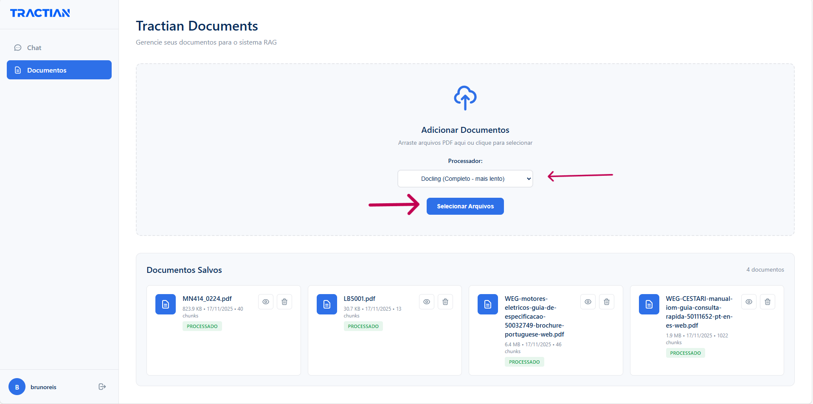
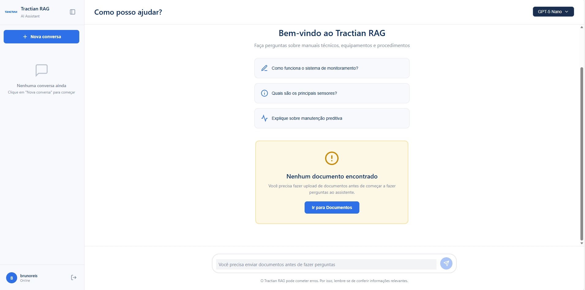
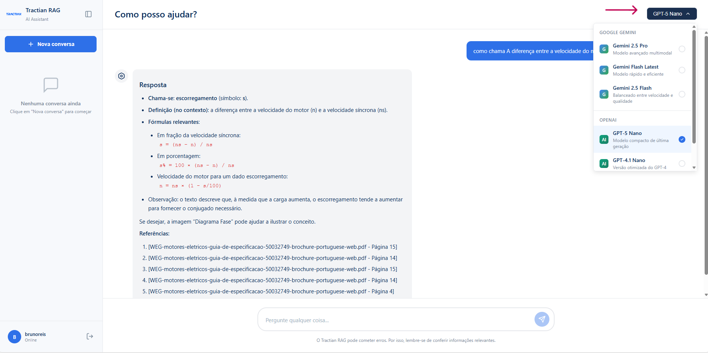
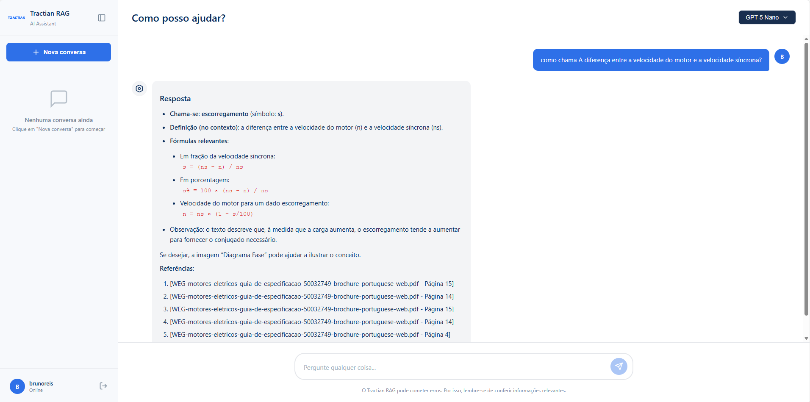

# Tractian ML Engineering - LLM Challenge

A **Multimodal RAG (Retrieval-Augmented Generation)** system for processing and querying technical PDF documents. Built for the Tractian Machine Learning Engineering challenge.

## 🚀 Features

- ✅ **PDF Upload & Processing**: Extract text, tables, images, and formulas from technical PDFs
- ✅ **Intelligent Chunking**: Adaptive chunking based on content type (formulas, tables, procedures, etc.)
- ✅ **OpenAI Embeddings**: text-embedding-3-large (3072 dimensions) via langchain-openai
- ✅ **Vector Search**: ChromaDB for efficient similarity search
- ✅ **LLM Integration**: Support for OpenAI GPT-4 and Google Gemini
- ✅ **User Management**: JWT authentication with SQLite database
- ✅ **Web Interface**: Complete frontend for document upload and Q&A

## 🏗️ Architecture

```
┌─────────────┐
│   FastAPI   │ ◄── REST API
└──────┬──────┘
       │
       ├──► Document Processing Pipeline
       │    ├── Docling (high quality) / FastPDF (fast)
       │    ├── Image Extraction (PyMuPDF)
       │    ├── Content Cleaning
       │    ├── Adaptive Chunking
       │    └── OpenAI Embeddings (text-embedding-3-large)
       │
       ├──► Vector Store (ChromaDB)
       │    └── Per-user collections
       │
       ├──► Database (SQLite)
       │    ├── Users & Auth
       │    ├── Documents metadata
       │    └── Images (base64)
       │
       └──► LLM Service
            ├── OpenAI GPT-4
            └── Google Gemini
```

## 📋 Requirements

- Python 3.10+
- 8GB+ RAM (for document processing)
- OpenAI API key or Google Gemini API key

## 🚀 Quick Start

### 1. Clone the repository

```bash
git clone https://github.com/reissbruno/tractian-ml-engineering-llm.git
cd tractian-ml-engineering-llm
```

### 2. Create virtual environment

```bash
python -m venv .venv

# Windows
.venv\Scripts\activate

# Linux/Mac
source .venv/bin/activate
```

### 3. Install dependencies

```bash
pip install -r requirements.txt
```

### 4. Set up environment variables

Create a `.env` file:

```env
# OpenAI (required if using OpenAI)
OPENAI_API_KEY=your-openai-api-key-here
OPENAI_MODEL=gpt-4o

# Google Gemini (required if using Gemini)
GOOGLE_API_KEY=your-gemini-api-key-here
GEMINI_MODEL=gemini-1.5-pro

# JWT Secret (change in production!)
JWT_SECRET_KEY=your-secret-key-here
JWT_EXPIRE_MINUTES=30

# Optional: Logging
LOG_LEVEL=INFO
API_NAME=tractian-ml-engineering-llm
```

### 5. Run the server

```bash
uvicorn server:app --reload --host 0.0.0.0 --port 8000
```

Or use the Makefile:

```bash
make run
```

### 6. Access the application

- **Web Interface:** http://localhost:8000
- **API Documentation:** http://localhost:8000/docs
- **Alternative Docs:** http://localhost:8000/redoc

## 📖 Usage Guide

### Step 1: Login or Register

When you first access the application at http://localhost:8000, you'll see the login screen:


If you don't have an account yet, click on "Criar uma conta aqui" to register a new user.

### Step 2: Upload Documents

After logging in, you'll be redirected to the document management page. Here you can:
- Upload PDF files (single or multiple)
- Choose between two processing modes:
  - **Fast**: Quick processing using PyMuPDF (~2-3s per page)
  - **Docling**: High-quality extraction with better table/formula recognition (~10-15s per page)
- View all your uploaded documents with their processing status



If no documents have been uploaded yet, you'll see an empty state:



### Step 3: Configure LLM Provider

Before asking questions, you can choose your preferred LLM provider and model:
- **OpenAI**: GPT-4o, GPT-4-turbo, GPT-3.5-turbo
- **Google Gemini**: gemini-1.5-pro, gemini-1.5-flash



### Step 4: Ask Questions

Once your documents are processed, navigate to the chat interface to ask questions:
- Type your question in natural language
- The system will search through your documents using semantic similarity
- Receive answers with references to the source pages
- Images from the relevant pages are automatically included in the context



The response includes:
- **Answer**: Generated by the LLM based on the retrieved context
- **References**: Links to specific pages in the source documents
- **Context**: Relevant text chunks and images extracted from your PDFs

## 🔌 API Endpoints

### Upload Documents

```bash
POST /documents
Content-Type: multipart/form-data

# Upload single file
curl -X POST "http://localhost:8000/documents" \
  -F "files=@document.pdf" \
  -F "processor=fast"

# Upload multiple files
curl -X POST "http://localhost:8000/documents" \
  -F "files=@doc1.pdf" \
  -F "files=@doc2.pdf" \
  -F "processor=docling"
```

**Response:**
```json
{
  "message": "Documents processed successfully",
  "documents_indexed": 2,
  "total_chunks": 128
}
```

**Parameters:**
- `processor`: `"fast"` (default, faster) or `"docling"` (higher quality)

### Ask Questions

```bash
POST /question
Content-Type: application/json

curl -X POST "http://localhost:8000/question" \
  -H "Content-Type: application/json" \
  -H "X-LLM-Provider: openai" \
  -H "X-LLM-Model: gpt-4o" \
  -d '{
    "question": "What is the power consumption of the motor?"
  }'
```

**Response:**
```json
{
  "answer": "The motor's power consumption is 2.3 kW at 60Hz line frequency.",
  "references": [
    "[Motor_Manual.pdf - Page 15]",
    "[Technical_Specs.pdf - Page 3]"
  ]
}
```

**Headers:**
- `X-LLM-Provider`: `openai` or `gemini` (optional, defaults to env var)
- `X-LLM-Model`: Model name (optional, defaults to env var)

### List Documents

```bash
GET /documents

curl -X GET "http://localhost:8000/documents"
```

### Delete Document

```bash
DELETE /documents/{doc_id}

curl -X DELETE "http://localhost:8000/documents/abc-123-def"
```

### User Authentication

```bash
# Register
POST /register
{
  "user_name": "john",
  "senha": "password123"
}

# Login
POST /login
{
  "user_name": "john",
  "senha": "password123"
}
```

## 🐳 Docker Deployment

```bash
# Build and run
docker-compose up --build

# Run in background
docker-compose up -d

# Stop
docker-compose down
```

Access at: http://localhost:8000

## 🛠️ Development

### Project Structure

```
.
├── src/
│   ├── auth/               # Authentication & database
│   │   ├── auth.py         # JWT, password hashing
│   │   └── database.py     # SQLAlchemy models
│   ├── services/           # Core services
│   │   ├── document_processor.py          # Docling processing
│   │   ├── fast_pdf_processor.py          # Fast PDF processing
│   │   ├── document_processor_vectorized.py  # Batch processing
│   │   ├── chunking_service.py            # Text chunking
│   │   ├── embeddings_service.py          # CLIP embeddings
│   │   ├── vector_store_service.py        # ChromaDB
│   │   ├── llm_service.py                 # LLM integration
│   │   ├── content_cleaner.py             # Markdown cleaning
│   │   └── document_analyzer.py           # Content analysis
│   ├── models.py           # Pydantic models
│   └── logger.py           # Centralized logging
├── static/                 # Frontend files
│   ├── login.html
│   ├── register.html
│   ├── documents.html
│   └── chat.html
├── server.py               # FastAPI application
├── requirements.txt        # Python dependencies
├── Dockerfile              # Docker configuration
├── docker-compose.yml      # Docker Compose setup
├── Makefile                # Development commands
└── README.md               # This file
```

### Run Tests

```bash
pytest

# With coverage
pytest --cov=src tests/

# Specific test file
pytest tests/test_chunking_service.py
```

### Code Quality

```bash
# Format code
make format

# Lint
make lint

# Type check
make typecheck
```

## 🎯 How It Works

### 1. Document Processing Pipeline

```
PDF → Docling/FastPDF → Markdown + Images
                      ↓
              Content Cleaning
                      ↓
              Adaptive Chunking
                      ↓
         OpenAI Embeddings (text-embedding-3-large)
                      ↓
              ChromaDB Storage
```

**Processors:**
- **Docling**: High quality extraction (tables, formulas, figures) - slower
- **FastPDF**: Fast extraction with heuristics - faster

### 2. Adaptive Chunking

Content is analyzed and chunked differently based on type:

| Content Type | Chunk Size | Overlap | Use Case |
|--------------|------------|---------|----------|
| Tables       | 300        | 50      | Structured data |
| Formulas     | 1200       | 150     | Mathematical content |
| Warnings     | 250        | 20      | Safety info |
| Procedures   | 400        | 80      | Step-by-step |
| Narrative    | 800        | 100     | General text |

### 3. RAG Query Flow

```
User Question
     ↓
Query Embedding (OpenAI text-embedding-3-large)
     ↓
Vector Search (ChromaDB) → Top 5 chunks
     ↓
Fetch Associated Images
     ↓
Build LLM Context (text + images)
     ↓
LLM Generation (GPT-4/Gemini)
     ↓
Answer + References
```

## 🔧 Configuration

### Environment Variables

| Variable | Default | Description |
|----------|---------|-------------|
| `OPENAI_API_KEY` | - | OpenAI API key (required if using OpenAI) |
| `OPENAI_MODEL` | `gpt-4o` | Default OpenAI model |
| `GOOGLE_API_KEY` | - | Google Gemini API key (required if using Gemini) |
| `GEMINI_MODEL` | `gemini-1.5-pro` | Default Gemini model |
| `JWT_SECRET_KEY` | `dev-secret-key...` | JWT signing key |
| `JWT_EXPIRE_MINUTES` | `30` | Token expiration time |
| `LOG_LEVEL` | `INFO` | Logging level |
| `API_NAME` | `tractian-ml-engineering-llm` | Logger name |

**Note:** LLM provider and model can be specified per request using HTTP headers (`X-LLM-Provider` and `X-LLM-Model`) instead of environment variables. Defaults to OpenAI with `gpt-4o`.

## 📊 Performance

### Processing Speed (approximate)

| Document Type | Pages | Time | Memory |
|---------------|-------|------|--------|
| Simple PDF    | 10    | ~20s | 500MB  |
| Technical Doc | 50    | ~2min| 1GB    |

### Query Response Time

- **Vector Search**: ~100-200ms
- **LLM Generation**: 2-5s (depends on context size)
- **Total**: ~2-5s per question